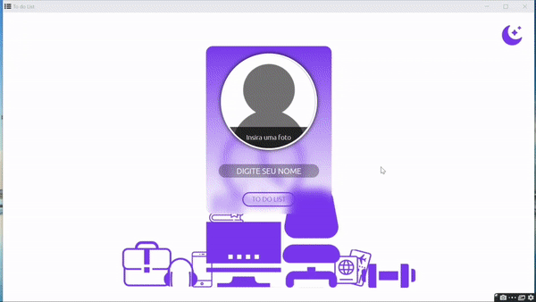

# 
 To do List 

  

## Deploy:
https://juniormacedo91.github.io/todo-list/

## About:
The main function about this application is add a bunch of items to make during the day.
I decided to go further and create new features like:
  - Login screen;
  - Add picture;
  - Dark mode;

All informations in the home page, like name and picture will be transfered to main page

## Techniques:

- [x] LocalStorage - Propriedade que permite acessar o objeto storage e:
  - Add Item - localStorage.setItem; 
  - Get Item - localStorage.getItem;
  - Remove Item - localStorage.remove;
- [x] setAttribute - Set an attribute or change a value;
- [x] Function - Cria um objeto function para uma determinada atividade;
- [x] Arrays - Objeto para criação de vetores, onde armazenamos diversos valores e resgatamos de acordo com a necessidade;

Como adendo, criei uma função dark mode. E para atualizar em todas as páginas, usei o setAttribute.

## Main challenges:

- Compreender melhor a lógica de function;
- Identificar um valor especifico em um array;
- Resgatar e aplicar os valores de localStorage como, foto e nome, em outra página;
- Entender e criar a lógica para aplicar dark mode em diversas páginas;

## Skills:

